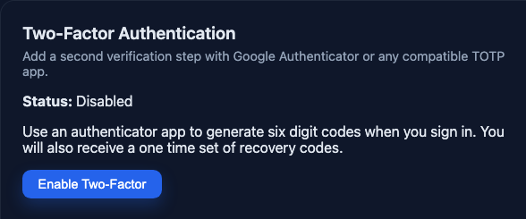
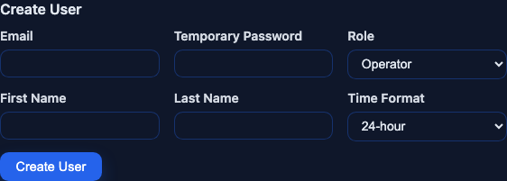
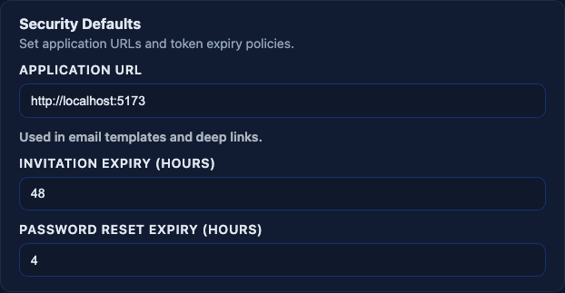
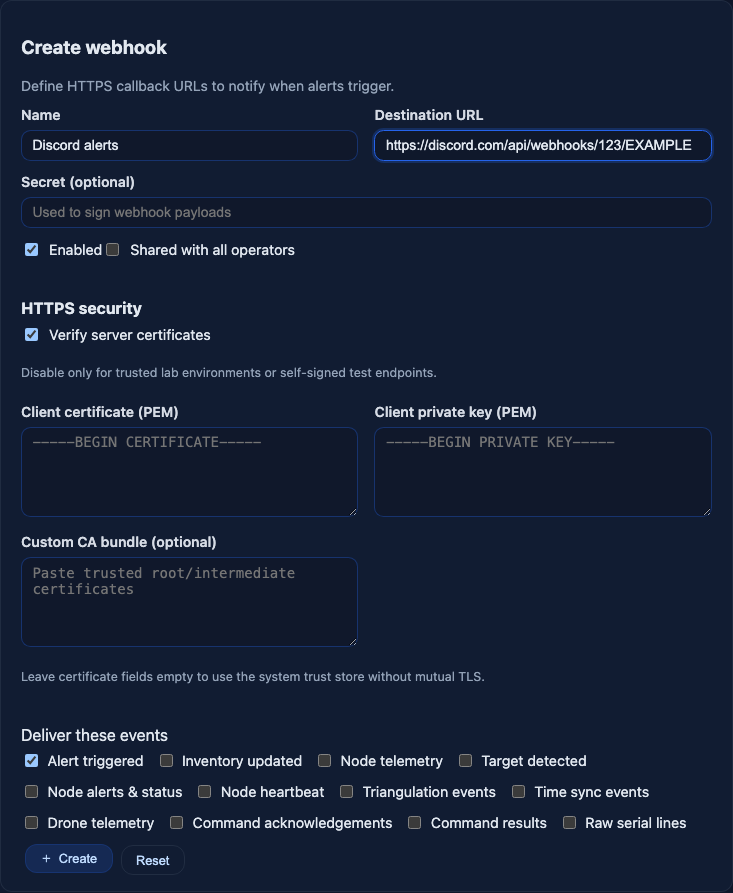
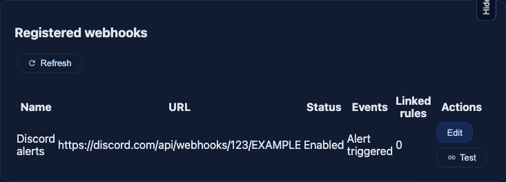
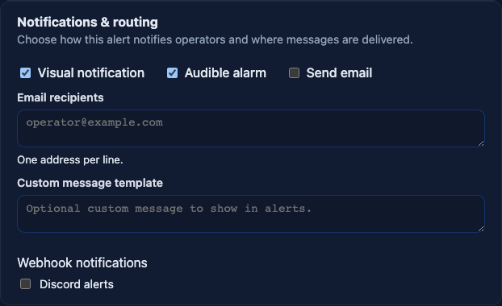

# AHCC Remote Connections

Reach AHCC from a phone or another site without opening a port on your router. Every step below ends with a **Check**. If the check fails, stop and fix that step before moving on.

## Contents

0. [First: passwords and 2FA](#prep)
1. [Tailscale: open AHCC from your phone (recommended)](#tailscale)
2. [Cloudflare Tunnel: open AHCC with an email login](#cloudflare)
3. [Alerts to your phone: push, Signal, ntfy, Matrix, Discord, IFTTT, Home Assistant](#alerts)
3a. [Apple Home and Google Home (Matter)](#matter)
4. [TAK bridge](#tak)
5. [MQTTS broker and site federation](#mqtts)
6. [Email alerts](#email)
7. [Webhooks (reference)](#webhooks)
8. [Meshtastic + TAK](#meshtastic)
9. [RBAC (accounts and roles)](#rbac)
10. [Bonus: Canarytokens tripwires](#canary)
11. [Quick reference](#quickref)

| I want to...                                      | Do this                          |
| ------------------------------------------------- | -------------------------------- |
| Use the full AHCC map and console from my phone   | [Tailscale](#tailscale)          |
| Let people in without installing an app           | [Cloudflare Tunnel](#cloudflare) |
| Get a message when something is detected          | [Alerts](#alerts)                |
| See alerts as sensors in Apple Home / Google Home | [Matter](#matter)                |
| See nodes and targets in iTAK/ATAK/WinTAK         | [TAK bridge](#tak)               |
| Feed raw JSON to scripts or Node-RED              | [MQTTS broker](#mqtts)           |
| Link two AHCC sites                               | [MQTTS federation](#mqtts)       |

Never forward ports 3000, 5173, 8080 or 5432 on your router, and never run `tailscale funnel` or a Cloudflare quick tunnel (`trycloudflare.com`). All of these put the AHCC login page on the public internet.

--------------------------------------------------------------------------------

0. First: passwords and 2FA
--------------------------------------------------------------------------------

Your first admin password was printed once at install: by the setup script, or for Docker by `docker compose logs backend | grep "Admin account created"`.

1. Sign in, open **Account** in the sidebar → **User Management** → **Manage** on your admin row → type a long password you will remember in **Set New Password** → **Save Changes**.
2. Open **Account** → **Security** → **Enable Two-Factor**. Scan the QR code with Google Authenticator, 1Password, Authy or any TOTP app, then enter the 6-digit code and click **Confirm Setup**. Save the recovery codes.

   

3. Give every person their own account: **Account** → **User Management** → **Create User**. Pick the lowest **Role** that works (VIEWER only looks, OPERATOR runs commands). See [RBAC](#rbac).

   

**Check:** sign out, sign back in. You are asked for a 6-digit code.

--------------------------------------------------------------------------------

1. Tailscale: open AHCC from your phone (recommended)
--------------------------------------------------------------------------------

Tailscale is a private network between your own devices. Only devices signed in to your Tailscale account can open AHCC. AHCC gets an HTTPS address like `https://ahcc-box.tail1234.ts.net` with a valid certificate. The free Personal plan covers 6 users.

### Docker: built-in Tailscale container

Docker installs can skip steps 2-5 below: `docker-compose.yml` has a `tailscale` service under the `remote` profile. It runs Tailscale in its own container, serves AHCC over HTTPS on your tailnet, and never turns on Funnel. Requests go through a separate nginx entrance (port 8081, not published) that checks each person's Tailscale login against an allowlist before AHCC's own login.

1. Do step 1 and step 3 below (account, MagicDNS + HTTPS Certificates), and paste the access-control policy from step 8 so `tag:ahcc` exists.
2. In the Tailscale admin console: **Settings** → **Keys** → **Generate auth key**. Tick **Tags** and pick `tag:ahcc`. Copy the key.
3. In `.env` next to `docker-compose.yml`:

       TS_AUTHKEY=tskey-auth-...
       TS_HOSTNAME=ahcc

4. `docker compose --profile remote up -d`
5. In AHCC: **Config** → **Remote Access & Alerts** → **Remote access (Tailscale)**. Enter the Tailscale login (email) of each person allowed in, one per line, and click **Save**. An empty list lets nobody in.

**Check:** on the phone with Tailscale on and Wi-Fi off, `https://ahcc.<your-tailnet>.ts.net` shows the AHCC login page. Remove your login from the list and reload: you get **403 Forbidden**.

Tagged devices (servers you tagged in Tailscale) carry no user login, so the entrance refuses them. Phones and laptops signed in as a person work.

**Step 1. Make an account.** Go to https://tailscale.com and sign in with Google, Microsoft, GitHub or Apple. Use the same login on every device below.

**Step 2. Install Tailscale on the AHCC computer.**

- Linux: `curl -fsSL https://tailscale.com/install.sh | sh` then `sudo tailscale up`, and open the link it prints to sign in.
- macOS / Windows: install the app from https://tailscale.com/download and sign in. On the macOS App Store version the command is `/Applications/Tailscale.app/Contents/MacOS/Tailscale` (use it wherever this guide says `tailscale`).

**Check:** `tailscale status` lists this computer.

**Step 3. Turn on HTTPS certificates.** Open https://console.tailscale.com/admin/dns. Turn on **MagicDNS**, then turn on **HTTPS Certificates** on the same page.

**Step 4. Publish AHCC on your tailnet.** On the AHCC computer, run the line that matches how you installed AHCC (add `sudo` on Linux):

| Installed with            | Command                                   |
| ------------------------- | ----------------------------------------- |
| Docker (`docker compose`) | `tailscale serve --bg localhost:8080`     |
| `pnpm dev` / setup script | `tailscale serve --bg localhost:5173`     |

Then run `tailscale serve status`. It shows your address, e.g. `https://ahcc-box.tail1234.ts.net`. `--bg` keeps it running after reboots.

**Step 5 (pnpm installs only). Allow that address.** The pnpm web server rejects addresses it does not know. Create `apps/frontend/.env` with your address, no `https://`, no trailing slash:

    AHCC_ALLOWED_HOSTS=ahcc-box.tail1234.ts.net

Restart AHCC (`Ctrl+C`, then `pnpm dev`). Docker installs skip this step.

**Check:** on the AHCC computer, open the `https://...ts.net` address. You see the AHCC login page with a padlock. If you see `Blocked request. This host (...) is not allowed`, step 5 is missing or has a typo.

**Step 6. Set the app URL.** **Config** → **Security Defaults** → **APPLICATION URL**: set it to your `https://...ts.net` address so links in emails point to it.

**Step 7. Phone.** Install Tailscale from the App Store / Play Store, sign in with the same account, turn it on, and open the `https://...ts.net` address in the browser. Add it to your home screen.

**Check:** the AHCC login page loads on the phone over mobile data (Wi-Fi off).

**Step 8. Lock the tailnet to AHCC's HTTPS port.** AHCC's own ports (3000 and 5173, plus 8080 and 5432 on Docker) only listen on the computer itself. Tailscale still lets every device on your tailnet reach every other port on the AHCC computer (SSH, file sharing). Restrict them to 443:

1. Open the **Access controls** tab in the Tailscale admin console. Replace the policy with the block below and save. If you use this tailnet for other things, keep your other rules and delete only the allow-all rule (`"src": ["*"], "dst": ["*"], "ip": ["*"]`).

       {
         "tagOwners": {
           "tag:ahcc": ["autogroup:admin"]
         },
         "grants": [
           {
             "src": ["autogroup:member"],
             "dst": ["tag:ahcc"],
             "ip": ["tcp:443"]
           }
         ]
       }

2. Open https://console.tailscale.com/admin/machines, click **...** on the AHCC computer's row → **Edit tags** → add `tag:ahcc`. Tagging makes the machine belong to the tailnet instead of your user and turns off key expiry.

**Check:** on the phone, `https://...ts.net` still loads. The AHCC computer's row on the Machines page shows `tag:ahcc`.

**Turn it off:** `tailscale serve reset`.

Security: no port is open to the internet. Tailscale encrypts traffic between your devices, and only devices signed in to your tailnet can connect. AHCC's login and 2FA still apply.

--------------------------------------------------------------------------------

2. Cloudflare Tunnel: open AHCC with an email login
--------------------------------------------------------------------------------

Use this when viewers cannot install Tailscale. Cloudflare puts a login page (a one-time code sent to an approved email) in front of AHCC. You need a free Cloudflare account and a domain whose DNS is on Cloudflare.

Do the steps in this order. If you add the tunnel route before the Access app, AHCC is public until the Access app exists.

**Step 1. Create the Access app.** In the Cloudflare dashboard: **Zero Trust** → **Access controls** → **Applications** → **Create new application** → **Self-hosted and private** → **Add public hostname**. Enter `ahcc` and pick your domain. Under **Access policies**, create a policy that allows only the email addresses of the people who need AHCC, and use One-time PIN as the login method. Click **Create**.

**Step 2. Create the tunnel.** **Networking** → **Tunnels** → **Create a tunnel** → name it `ahcc` → **Create Tunnel**. Pick the AHCC computer's operating system and run the install command it shows on that computer. Click **Continue** once it shows connected.

**Step 3. Route the hostname to AHCC.** Open the tunnel → **Routes** tab → **Add route** → **Published application**. Subdomain `ahcc`, your **Domain**, **Service URL**:

- Docker: `http://localhost:8080`
- pnpm: `http://localhost:5173`, and add `AHCC_ALLOWED_HOSTS=ahcc.yourdomain.com` to `apps/frontend/.env`, then restart AHCC (see [Tailscale step 5](#tailscale)).

Click **Add route**.

**Check:** open `https://ahcc.yourdomain.com` in a private browser window. You see Cloudflare's email-code page first, not AHCC. An email that is not on the list never gets a code.

Security: the tunnel dials out from the AHCC computer, so no port opens on your router. Cloudflare checks the email code before any traffic reaches AHCC. Cloudflare decrypts the traffic at its edge; use Tailscale if you do not want a third party to see it.

--------------------------------------------------------------------------------

3. Alerts to your phone: push, Signal, ntfy, Matrix, Discord, IFTTT, Home Assistant
--------------------------------------------------------------------------------

No remote access needed. AHCC dials out to the service when an alert rule fires, when an alert arrives over MQTT, and when a node reports an ALERT-level event (attack, tamper, erase, ALERT-level vibration). Node heartbeats and other INFO/NOTICE messages are not sent. Each message carries the rule and severity, the alert text, and the device MAC, SSID, RSSI, channel, node, location and time when the alert has them.

Set push, Signal, ntfy, Matrix and Matter in **Config** → **Remote Access & Alerts**. Only admins see these settings, and only admins with two-factor authentication turned on can change them or send tests ([step 0](#prep)). Each card has **Send test**.

Tokens and the push signing key are encrypted in the database (AES-256-GCM). The key is `REMOTE_ALERTS_SECRET_KEY`, or a random key written once to `apps/backend/.secrets/remote-alerts.key` (Docker: the `remote-secrets` volume). A database dump alone does not reveal them. Back up the key with the database; without it, re-enter the tokens and press **Replace keys**. Discord, Slack, IFTTT and Home Assistant are webhooks in **Config** → **Webhooks**.

| Channel | Who can read the alert text | Setup |
| ------- | --------------------------- | ----- |
| Phone push | only your phone (end-to-end encrypted) | one tap per phone |
| Signal | only the recipients (end-to-end encrypted) | link a device once |
| Matter (Apple/Google Home) | no text is sent, only sensor on/off | scan a code, needs a home hub |
| Matrix | your homeserver | bot account |
| ntfy | the ntfy server | topic URL + token |
| Discord, Slack, IFTTT | the provider | paste a URL |

### Phone push (end-to-end encrypted)

The alert is encrypted on the AHCC computer for your phone's key; Apple, Google or Mozilla relay it but cannot read it.

1. **Config** → **Remote Access & Alerts** → **Phone push notifications** → **Generate keys** (once per install).
2. Open AHCC over HTTPS on the phone (the Tailscale address). On iPhone/iPad (iOS 16.4 or newer): **Share** → **Add to Home Screen**, then open AHCC from the Home Screen icon. Android: Chrome works directly.
3. **Config** → **Remote Access & Alerts** → **Push notifications on this device** → **Enable on this device** → allow notifications.
4. **Send test**.

**Check:** a notification arrives; tapping it opens **Alerts** → **Event Log**. The device appears under **Subscribed devices** on the admin card, where you can remove it.

**Replace keys** signs out every subscribed device; each one presses **Enable** again.

### Signal (end-to-end encrypted)

AHCC sends through a Signal account you link like Signal Desktop. Use a spare number or your own.

1. Link once. The Signal API has no password, so it only gets a port while you link:

       docker compose --profile signal run --rm -p 127.0.0.1:8090:8080 signal-api

   Open http://127.0.0.1:8090/v1/qrcodelink?device_name=ahcc on the AHCC computer. On the phone: Signal → **Settings** → **Linked devices** → **+** → scan. Then press `Ctrl+C`.
2. `docker compose --profile signal up -d` (no published port; only the backend reaches it).
3. **Config** → **Remote Access & Alerts** → **Signal**: tick **Send alerts to Signal**, Signal API URL `http://signal-api:8080`, the linked number, recipients one per line (`+15551234567`). **Save**, **Send test**.

**Check:** the recipients get `AntiHunter test`.

### ntfy

The ntfy server can read every alert. Run your own ntfy server, require login, and give AHCC an access token with write access to one topic.

**Config** → **Remote Access & Alerts** → **ntfy**: tick the box, topic URL (`https://ntfy.example.com/ahcc-alerts`), access token (`tk_...`), **Save**, **Send test**. Critical alerts use priority 5.

### Matrix

Messages are not end-to-end encrypted; the homeserver can read them. Use your own homeserver, a bot account, and a private room. **Config** → **Remote Access & Alerts** → **Matrix**: homeserver URL, room ID (`!abc:example.com`), bot access token, **Save**, **Send test**.

URLs for ntfy, Signal and Matrix must be `https://`, or `http://` to `localhost` or `signal-api`, with no username or password in the URL. Tokens are never shown again after saving; leave the field blank to keep the saved one, or click **Remove token**.

Treat every webhook URL below as a password: anyone who has it can post to your channel. Don't paste it in chats or screenshots.

Alert text from nodes can contain names chosen by whoever owns the detected device (Wi-Fi SSIDs, BLE names). AHCC escapes it for Discord and Slack and turns off Discord mentions, so a device named `@everyone [click](https://...)` shows as plain text.

### Discord

1. In Discord: hover the channel → gear (**Edit Channel**) → **Integrations** → **Webhooks** → **New Webhook** → **Copy Webhook URL**.
2. In AHCC: **Config** → **Webhooks** → **Create webhook**. **Name** `Discord alerts`, paste the URL into **Destination URL**, leave **Verify server certificates** ticked, tick only **Alert triggered**, click **Create**.

   

3. In **Registered webhooks**, click **Test** on the new row, then **Edit** to see **Recent deliveries**.

   

   **Check:** the Discord channel shows `[INFO] Test payload from Command Center ...` and Recent deliveries says **Success**.

4. Connect it to a rule: **Alerts** → pick or create a rule → **Notifications & routing** → tick **Discord alerts** under **Webhook notifications** → save.

   

### IFTTT (SMS, phone notification, smart lights)

1. At https://ifttt.com create an applet. **If This** → **Webhooks** → **Receive a web request with a JSON payload** → event name `ahcc_alert`. **Then That**: any action (notification, SMS, lights). Use the `{{JsonPayload}}` ingredient for the text.
2. Get your key: https://ifttt.com/maker_webhooks → **Documentation**.
3. In AHCC, create a webhook with **Destination URL** `https://maker.ifttt.com/trigger/ahcc_alert/json/with/key/<your key>` and **Alert triggered** ticked. Click **Test**.

**Check:** the IFTTT action fires.

### Home Assistant

1. In Home Assistant: **Settings** → **Automations** → **Create automation** → trigger **Webhook**. Copy the webhook ID. Keep **Only accessible from the local network** on if AHCC is on the same network.
2. In AHCC, create a webhook with **Preset** `Home Assistant / Apple Home`, **Destination URL** `https://<home-assistant-host>/api/webhook/<webhook_id>`, **Alert triggered** and **Node alerts & status** ticked. **Test**.
3. In the automation, use `{{ trigger.json.summary }}` for the text, `{{ trigger.json.rule.severity }}` for the level and `{{ trigger.json.data.mac }}` for the device.

**Check:** the automation's trace shows the test run.

--------------------------------------------------------------------------------

3a. Apple Home and Google Home (Matter)
--------------------------------------------------------------------------------

AHCC can run a Matter device that Apple Home and Google Home add like any smart-home sensor. It shows two occupancy sensors:

| Sensor | Turns on for |
| ------ | ------------ |
| **AntiHunter Alert** | every source set to Alert or Critical |
| **AntiHunter Critical** | only the sources you set to Critical |

You pick the level per source in **Config** → **Remote Access & Alerts** → **What counts as Alert or Critical**: each alert rule by name, each node event type (deauth/disassoc attack, tamper, erase, vibration, mesh guard, other ALERT-level events) and alerts from linked MQTT sites. Each source is **Off**, **Alert** or **Critical**. Everything starts as Alert and nothing is Critical until you choose it. The same levels apply to phone push, Signal, ntfy and Matrix: Critical messages start with `CRITICAL:` and use ntfy priority 5; Off sends nothing to those channels (webhooks and email are unchanged).

Node heartbeats, GPS fixes, startup, baseline and new-device notices (INFO and NOTICE) never reach these channels; they stay in the AHCC console. To alert on a specific device, create an alert rule for it and set its level here.
 Each turns on when an alert fires and turns off after 60 seconds. Home then sends its own notifications and can run automations (turn on lights, sound a HomePod). No alert text is sent, only on/off.

Needs a home hub: HomePod, HomePod mini, Apple TV or iPad for Apple Home; a Nest speaker/display, Google TV Streamer or Nest Wifi Pro for Google Home. The phone and the AHCC computer must be on the same network while pairing.

**macOS: build the signed app first.** The Matter device accepts connections from your hub, so macOS's firewall must let it in. Allow only a dedicated, signed program, never `node`:

    cd apps/backend
    CODESIGN_IDENTITY="Developer ID Application: <you> (<TEAMID>)" NOTARY_PROFILE=<notarytool profile> tools/matter/build.sh

This builds `apps/backend/bin/matter/ahcc-matter` with Bun, signs it with your Developer ID and hardened runtime, and notarizes it. Set `AHCC_MATTER_BIN` to that path in `apps/backend/.env` and restart AHCC. When macOS asks whether **ahcc-matter** may accept incoming connections, click **Allow**. The backend talks to it over a pipe, and it only gets its own settings, not the database password or API keys. Linux and Docker skip this step.

**Pair it.**

1. **Config** → **Remote Access & Alerts** → **Apple Home / Google Home (Matter)** → tick **Run the Matter device**, Layout **Bridge with named sensors**, **Save**. State changes to `waiting to pair` and the card shows a QR code, a **Setup code** and an **8-digit passcode**.
2. Apple Home: **+** → **Add Accessory** → point the camera at the QR code on screen. Accept the uncertified-accessory warning. Google Home: **Devices** → **Add** → **Matter-enabled device** → scan the QR code. If the camera won't read it, choose **More options** and type the setup code.
3. **Test (both sensors on)**.

**Check:** both sensors show occupancy detected in Home, and the card shows `paired`.

**Reset pairing** removes AntiHunter from every home it was added to and shows a new code. Changing **Layout** changes how Home sees the device: remove AntiHunter from Home and pair again afterwards. Pairings made before the named-sensor layout use **Two unnamed sensors**; fire a test alert (ALERT level turns on only the any-alert sensor) to tell them apart and rename them in Home.

Docker: Matter pairing uses local-network discovery (mDNS), which Docker's default network does not pass. Run the backend outside Docker, or with host networking, to pair.

Lock it down

- Set `AHCC_MATTER_INTERFACE` (e.g. `en0`, `eth0`) to listen and announce only on your home network interface, not on VPN or Docker interfaces.
- Pairing state, including the device's private keys, is stored in `AHCC_MATTER_STORAGE` (default `apps/backend/.matter`) with permissions `0700`/`0600`. Keep it out of backups you share.
- The setup code is printed in the backend log until the device is paired. Pair it right away.
- Google Home may show one bridged sensor as "Matter device" instead of its name (open Matter SDK bug, no fix yet). Rename it in Google Home.

--------------------------------------------------------------------------------

4. TAK bridge -> TAK server -> iTAK/ATAK/WinTAK
--------------------------------------------------------------------------------

AHCC turns its events into CoT and sends them to a single TAK server. It can send over UDP, plain TCP, or TLS. Plain TCP and UDP are unencrypted, so keep those on localhost or Tailscale. Turn on TLS (set TAK_TLS=true and the cert fields) and AHCC verifies the server's certificate, so that hop is safe to cross the internet.

iTAK can't connect to AHCC directly, so the TAK server sits in the middle. AHCC feeds it locally, and iTAK connects to the server over TLS. That server-to-iTAK hop is the encrypted one that crosses the internet.

Free servers: OpenTAKServer (easiest), FreeTAKServer, TAK Server. The plaintext CoT port is around 8087 or 8088. The TLS streaming port is 8089. Check your server's docs.

1. Install OpenTAKServer on the AHCC host, or on a VPN-only machine.
2. Migrate if you haven't: `pnpm --filter @command-center/backend prisma migrate deploy`
3. Set the bridge in apps/backend/.env:

       TAK_ENABLED=true
       TAK_PROTOCOL=TCP
       TAK_HOST=127.0.0.1
       TAK_PORT=8088
       TAK_TLS=false   # set true for TLS; add cafile/certfile/keyfile (PEM text or file path)

   Or use Config -> TAK Bridge in the UI. The UI wins after you save. Restart the bridge.
4. Turn on the streams you want (Config -> TAK Bridge -> Streams).
5. Make an enrol QR or data package on the server for the phone.
6. Add the server in iTAK over the VPN. Use the TLS streaming port.
7. Promote a detection in AHCC. Check that an AHCC-TARGET-* marker shows up.

By default AHCC streams node telemetry, target detections, and the Notice, Alert, and Critical alert levels; Info alerts and command results stay off. It also reads CoT coming back and saves those positions as nodes, but it never accepts commands, so you can't control your nodes from iTAK.

Lock it down

- Only the TLS port (8089) faces the internet. Block the plaintext CoT port.
- Require client certs on the server. Revoke lost devices. Use TLS 1.2 or newer and your own certificate, not the installer's sample.
- With TLS on, AHCC verifies the server's certificate. `cafile` pins a private CA; `certfile` and `keyfile` add a client cert for mutual TLS. `TAK_TLS_INSECURE=true` turns the check off; don't use it.
- Only connect AHCC to a TAK server you control. It trusts positions it receives.

--------------------------------------------------------------------------------

5. MQTTS broker and site federation
--------------------------------------------------------------------------------

Every site connects to one shared broker and publishes its data under `ahcc/<siteId>/`, where siteId is the site's SITE_ID from .env (unique per site). Because each site also subscribes, two sites on the same broker see each other's topics and stay in sync on their own. Messages use QoS 1. To read everything from every site at once, subscribe to `ahcc/#`.

| Topic                        | Payload                                    |
| ---------------------------- | ------------------------------------------ |
| `ahcc/<siteId>/nodes/upsert`      | Node snapshot per heartbeat                |
| `ahcc/<siteId>/inventory/upsert`  | Device: MAC, vendor, RSSI, position        |
| `ahcc/<siteId>/targets/upsert`    | Target lifecycle                           |
| `ahcc/<siteId>/targets/delete`    | `{ targetId }`                             |
| `ahcc/<siteId>/geofences/upsert`  | Geofence upsert                            |
| `ahcc/<siteId>/geofences/delete`  | Geofence removal                           |
| `ahcc/<siteId>/geofences/snapshot`| Full geofence set                          |
| `ahcc/<siteId>/drones/upsert`     | Drone telemetry                            |
| `ahcc/<siteId>/commands/events`   | Command lifecycle                          |
| `ahcc/<siteId>/commands/request`  | Remote command request                     |
| `ahcc/<siteId>/events/<type>`     | Alerts and events. `<type>` is the event name with dots and slashes turned into dashes, e.g. `event-alert` |

Mosquitto is the default: tiny, free, and configured through plain passwd and acl files. EMQX Open Source is heavier but adds a web dashboard for managing users. Neither needs clustering.

1. Install Mosquitto on a VPS or the AHCC host. Get a cert with certbot.
2. Set up a listener in /etc/mosquitto/conf.d/ahcc.conf:

       listener 8883
       certfile /etc/mosquitto/certs/fullchain.pem
       keyfile  /etc/mosquitto/certs/privkey.pem
       allow_anonymous false
       password_file /etc/mosquitto/passwd
       acl_file /etc/mosquitto/acl

3. Add one readwrite user per site and a read-only viewer:

       mosquitto_passwd -c /etc/mosquitto/passwd ahcc-alpha
       mosquitto_passwd    /etc/mosquitto/passwd viewer

   In the acl: `ahcc-alpha` gets `readwrite ahcc/#`, `viewer` gets `read ahcc/#`.
4. Open 8883, not 1883. Restart Mosquitto.
5. Point AHCC at it (Config -> MQTT). Set brokerUrl to `mqtts://host:8883`, a unique clientId, the username and password, and tlsEnabled. Leave caPem empty for a public cert.

Read the feed with MQTTX or any client:

    mqttx sub -h mqtt.example.com -p 8883 -u viewer -P 'password' -t 'ahcc/#'

To add a second site, give it its own SITE_ID, clientId, and readwrite user. Both sites then share nodes, inventory, targets, geofences, drones, and chat. Each can command the other's serial workers.

Lock it down

- AHCC verifies the broker's cert by default. For a private cert, paste its CA into caPem. MQTT_TLS_INSECURE=true turns the check off. Don't use it.
- Set allow_anonymous false. One account per site. Give viewers read-only.
- Use TLS 1.2 or newer. Only AHCC should publish to commands/request. That topic runs commands on your nodes.
- The broker password and certs sit in AHCC's database as plain text. Protect it.

--------------------------------------------------------------------------------

6. Email alerts
--------------------------------------------------------------------------------

The simplest route: no VPN, broker, or TAK server. AHCC emails you whenever an alert rule matches.

1. Set the SMTP values in apps/backend/.env, then restart:

       MAIL_ENABLED=true
       MAIL_HOST=smtp.example.com
       MAIL_PORT=587
       MAIL_SECURE=false
       MAIL_USER=alerts@example.com
       MAIL_PASS=app-password
       MAIL_FROM="AHCC <alerts@example.com>"

2. In each alert rule, turn on Email and add recipients.
3. Test with MAIL_PREVIEW=true. It logs instead of sending. Or trigger an event.

Port 587 is STARTTLS. Port 465 needs MAIL_SECURE=true. Never use 25. MAIL_PASS is stored in plain text.

Lock it down

- Use a dedicated sending account with an app password. Not your mailbox password.
- Set up SPF and DKIM on the sending domain. That stops spoofing and spam filtering.
- The emails carry MACs and locations. Keep the recipient list short.

--------------------------------------------------------------------------------

7. Webhooks (reference)
--------------------------------------------------------------------------------

AHCC POSTs events to an HTTPS endpoint. It only dials out. Step-by-step setups for Discord and IFTTT are in [Alerts](#alerts).

Body fields: `summary` (one-line plain text), `content` + `embeds` + `allowed_mentions` (Discord, escaped), `text` (Slack, escaped), `event`, `eventType`, `rule`, `data` (message, MAC, node, SSID, channel, RSSI, lat/lon, siteId, timestamp), `payload` (event-specific).

1. Open Config -> Webhooks. Add the https URL of your receiver.
2. Set a secret. AHCC signs each POST body with HMAC-SHA256 using it (hex, `x-webhook-signature` header). Your receiver checks the signature.
3. Pick the events to send. Add a CA bundle and client cert for mutual TLS.
4. Hit the test button. Check the delivery log.

Lock it down

- Use https only. AHCC verifies the endpoint's cert by default.
- Check the signature on your receiver. Reject old timestamps to block replays.
- AHCC doesn't check where the URL points. It can hit your LAN or a cloud metadata address. Keep webhooks admin-only.

--------------------------------------------------------------------------------

8. Meshtastic + TAK (LoRa, not internet)
--------------------------------------------------------------------------------

The Meshtastic app's TAK feature carries Meshtastic's own CoT between nodes (positions, chat, markers), not AntiHunter detections, which are plain text frames rather than CoT. It also runs over LoRa, not the internet. To get detections into TAK, use the [TAK bridge](#tak).

--------------------------------------------------------------------------------

9. RBAC (accounts and roles)
--------------------------------------------------------------------------------

Each account gets one role.

| Role     | Can                                            |
| -------- | ---------------------------------------------- |
| ADMIN    | Everything: users, config, firewall            |
| OPERATOR | Run commands, manage targets and geofences     |
| ANALYST  | Review data, inventory, exports                |
| VIEWER   | Read-only map and console                      |

Roles are checked on every API call. Changes go to the AuditLog. RBAC covers AHCC accounts only. TAK and broker users have their own logins.

Lock it down

- One account per person. Give the lowest role that fits.
- Require 2FA on ADMIN and on any remote login.
- Keep ADMINs few. Disable accounts instead of sharing them.

--------------------------------------------------------------------------------

10. Bonus: Canarytokens tripwires
--------------------------------------------------------------------------------

A canarytoken is a fake file, link or credential that emails you the moment someone opens or uses it. Free at https://canarytokens.org, no account.

1. Open https://canarytokens.org and pick a token type.
2. Enter the email that gets the alert, and a memo that tells you where you planted it (e.g. `USB stick in node case 3`).
3. Click create, then download or copy what it gives you.

Where to plant them near an AHCC deployment:

| Token             | Plant it                                                                | Fires when                           |
| ----------------- | ----------------------------------------------------------------------- | ------------------------------------ |
| WireGuard config  | Save as `ahcc-remote.conf` on the AHCC computer's desktop or a USB stick | someone tries to connect with it     |
| QR code           | Sticker on a node enclosure or the AHCC box                              | someone scans it                     |
| AWS API keys      | `~/.aws/credentials` on the AHCC computer                                | someone tries the keys               |
| Word / PDF        | `AHCC-admin-passwords.docx` in the AHCC folder                           | someone opens it                     |
| Web bug (URL)     | A bookmark or note named "AHCC admin"                                    | someone opens the link               |

The alert includes the IP address, time and browser of whoever tripped it. Never put a real credential next to a token.

--------------------------------------------------------------------------------

11. Quick reference
--------------------------------------------------------------------------------

| Hop                         | Encrypted by                   | Crosses internet?     |
| --------------------------- | ------------------------------ | --------------------- |
| Phone -> AHCC (Tailscale)   | Tailscale (WireGuard) + ts.net HTTPS | yes, tailnet only |
| Browser -> AHCC (Cloudflare)| Cloudflare HTTPS + Access login | yes, approved emails only |
| Browser -> AHCC UI (LAN)    | yes if HTTPS_* set, else none  | no                    |
| AHCC -> TAK server          | TLS if enabled, else none      | yes with TLS          |
| TAK server -> iTAK          | server's TLS (8089)            | yes                   |
| AHCC -> MQTT broker         | yes (caPem for private CA)     | yes                   |
| AHCC -> webhook             | yes (HMAC, mTLS)               | yes                   |
| AHCC -> phone push          | end-to-end (RFC 8291) via Apple/Google/Mozilla relay | yes          |
| AHCC -> Signal              | end-to-end (Signal protocol)   | yes                   |
| AHCC -> ntfy / Matrix       | TLS to your server; server reads it | yes              |
| Hub/phone -> Matter device  | Matter (CASE/PASE sessions)    | no, LAN only          |
| AHCC -> SMTP server         | STARTTLS/TLS                   | yes                   |
